### Hi there 👋

++++++++++ UNDER WORK +++++++++++

Mainly office based projects, very few personal incomplete projects

 
 

  

 
<h2 align="center">🛠️ Technologies & Tools I use 🛠️</h2>

  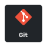
  
  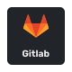
  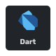
  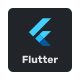
  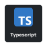
  
  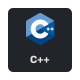
  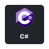
  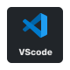
  
  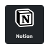
  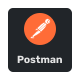
  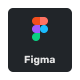
  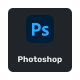
  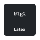
  
  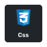
  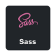
  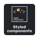
  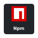
  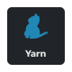
  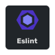
  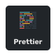
  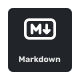
  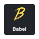
  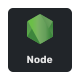
  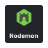
  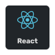
  
  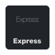
  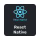
  
  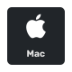
  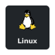
  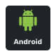
  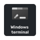
  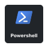
  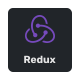
  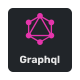
  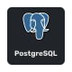
  
  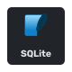
  
  
  
  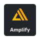
  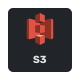

